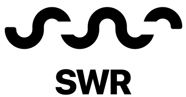
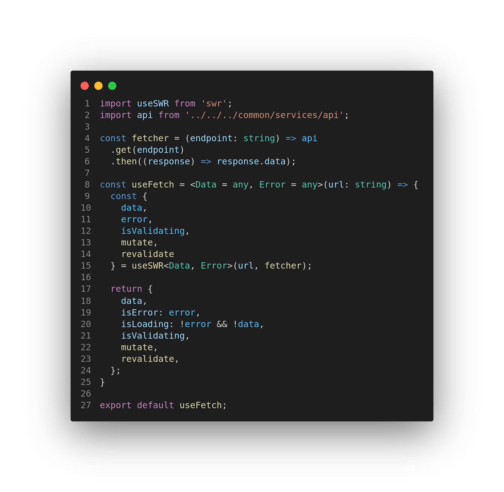

<div align="center" >
  
  
</div>
&nbsp;

<h1> SWR - POC</h1>

<p align="left">
   <a href="https://github.com/danieljpgo">
      
   </a>
   
   <a href="https://github.com/danieljpgo/swr-poc/graphs/contributors">
      
   </a>
    <a href="https://github.com/danieljpgo/swr-poc/network/members">
      
   </a>
     
</p>

> A proof of concept of the <a href="https://vercel.com/">Vercel's</a> HTTP cache invalidation strategy <a href="https://swr.vercel.app/">SWR</a> library. :clipboard:

&nbsp;

<div align="center">
   <a href="#project">Project</a>&nbsp;&nbsp;&nbsp;|&nbsp;&nbsp;&nbsp;
   <a href="#features">Features</a>&nbsp;&nbsp;&nbsp;|&nbsp;&nbsp;&nbsp;
   <a href="#technologies">Technologies</a>&nbsp;&nbsp;&nbsp;|&nbsp;&nbsp;&nbsp;
   <a href="#getting-started">Getting Started</a>&nbsp;&nbsp;&nbsp;|&nbsp;&nbsp;&nbsp;
   <a href="#license">License</a>
</div>
<div align="center">
   
   <div>
      <b>useFetch Hook</b>, responsible for the <s>magic</s>.
   </div>
</div>

&nbsp;

## Project

The idea of ​​this project, was to test a data fetch solution, which used cache strategies to solve data persistence and state management, however, SWR delivers much more functionality, ~~which is incredible~~.

## Features

The following hook was implemented to create an abstraction of the **useSWR** hook:

- **useFetch Hook**

Main use cases for the library are listed below:

- **Revalidate on focus.**
<div align="center">
   
</div>
&nbsp;

- **Persisting request data using cache strategies.**
<div align="center">
   
</div>
&nbsp;

- **Editing the local route cache and related routes cache.**
<div align="center">
   
</div>
&nbsp;

- **Adding data to local cache and on related route.**
<div align="center">
   
</div>

## Technologies

The main technologies used to develop the project were:

- [React](https://reactjs.org/)
- [SWR](https://swr.vercel.app/)
- [JSON Server](https://github.com/typicode/json-server)
<!-- - [Styled Component](https://styled-components.com/) -->
- [Typescript](https://www.typescriptlang.org/)

This project was bootstrapped with:

- [create-react-app](https://github.com/facebook/create-react-app)

## Getting Started

First of all, you may clone this project:

```
git clone https://github.com/danieljpgo/swr-poc.git
```

Run the following scripts in order to execute the application:

```
// install dependencies
yarn install

// start the server
yarn server

// start the application
yarn start
```

## License

This project is under the [MIT license](https://github.com/danieljpgo/swr-poc/blob/master/LICENSE).

<div>Released in 2020.</div>

Make with ❤️ by [Daniel Jorge](https://github.com/danieljpgo)

<!-- TODO -->
<!-- [] testes para validar todas as funcionalidades para cada aplicação futura -->
<!-- [] atualizar react router dom -->
<!-- toaster global para ações de sucesso e falha -->
<!-- corrigir nomes -->
