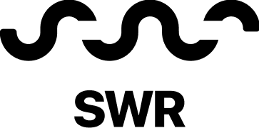
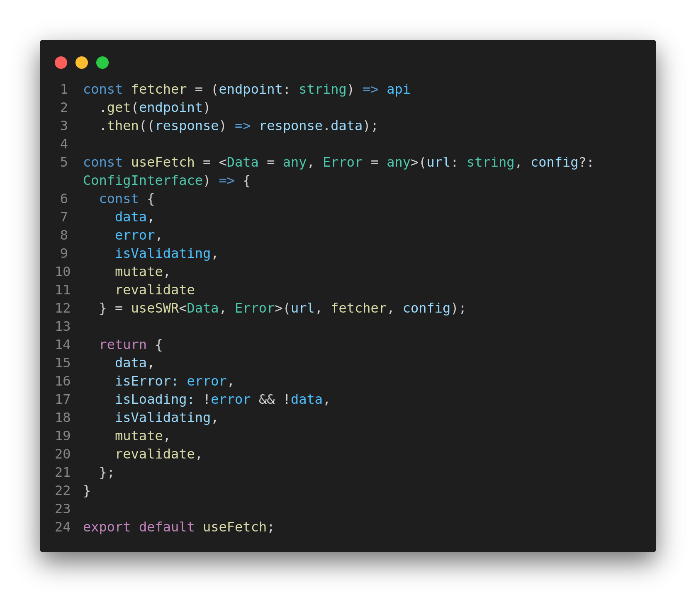

&nbsp;
<div align="center" >
  
  
</div>
&nbsp;

<h1> SWR - POC</h1>

---

<p align="left">
   <a href="https://github.com/danieljpgo">
      
   </a>
   
   <a href="https://github.com/danieljpgo/swr-poc/graphs/contributors">
      
   </a>
    <a href="https://github.com/danieljpgo/swr-poc/network/members">
      
   </a>
     
</p>

> A proof of concept of the <a href="https://vercel.com/">Vercel's</a> HTTP cache invalidation strategy <a href="https://swr.vercel.app/">SWR library</a>. :clipboard:

&nbsp;

<p align="center">
   <a href="#memo-project">Project</a>&nbsp;&nbsp;&nbsp;|&nbsp;&nbsp;&nbsp;
   <a href="#pushpin-topics">Topics</a>&nbsp;&nbsp;&nbsp;|&nbsp;&nbsp;&nbsp;
   <a href="#man_technologist-technologies">Technologies</a>&nbsp;&nbsp;&nbsp;|&nbsp;&nbsp;&nbsp;
   <a href="#runner-getting-started">Getting Started</a>&nbsp;&nbsp;&nbsp;|&nbsp;&nbsp;&nbsp;
   <a href="#page_with_curl-license">License</a>
</p>

<div align="center">
   
</div>

#### :memo: Project
... :construction: under construction :construction:

#### :pushpin: Topics
... :construction: under construction :construction:

#### :man_technologist: Technologies
The main technologies used to develop the project were:
- [React](https://reactjs.org/)
- [SWR](https://swr.vercel.app/)
- [JSON Server](https://github.com/typicode/json-server)
- [Styled Component](https://styled-components.com/)
- [Typescript](https://www.typescriptlang.org/)

This project was bootstrapped with:
- [create-react-app](https://github.com/facebook/create-react-app)

#### :runner: Getting Started
First, make sure you have **[Node](https://nodejs.org/en/)** and **[Yarn](https://yarnpkg.com/)**, then clone the project with:
```
git clone https://github.com/danieljpgo/swr-poc.git
```
With **[Yarn](https://yarnpkg.com/)**, install dependencies:
```
yarn install
```
Run the [JSON Server](https://github.com/typicode/json-server), for a fake REST API, execute:
```
yarn server
```
In order to **start** the application in a development environment, execute:
```
yarn start
```

#### :page_with_curl: License
This project is under the [MIT license](https://github.com/danieljpgo/posts-motion/blob/master/LICENSE).
<div>Released in 2020.</div>

Make with ❤️ by [Daniel Jorge](https://github.com/danieljpgo)